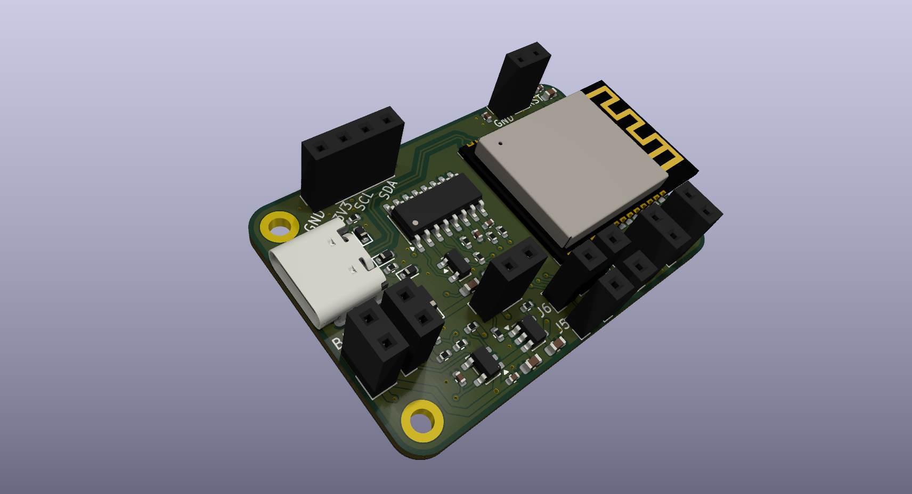
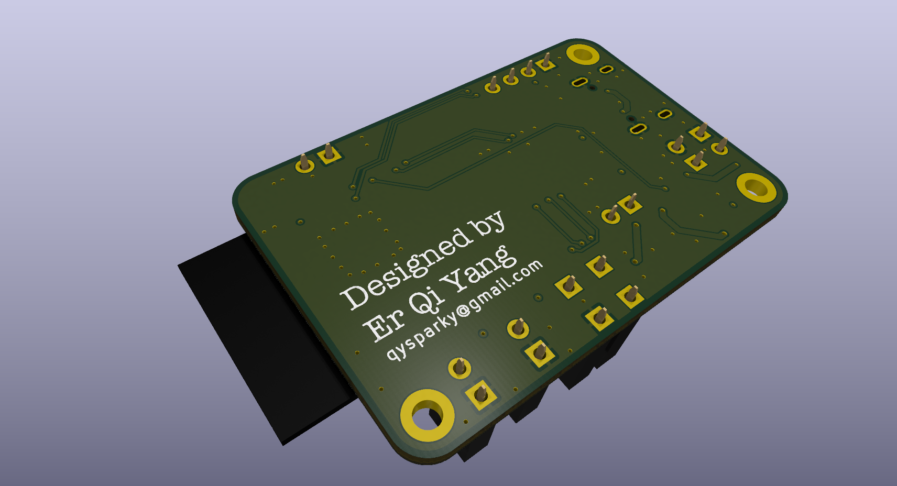
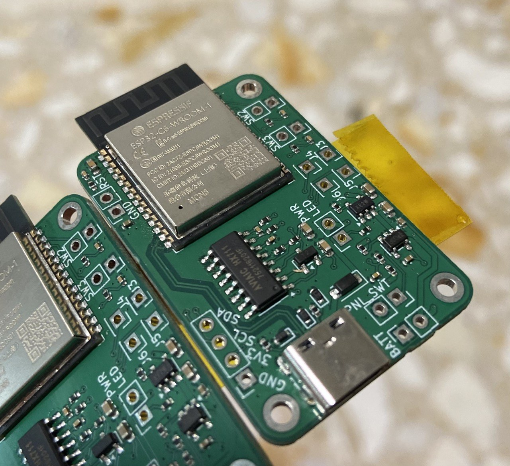

<div align="center">


**On-device firmware for the crimp-ER hangboard scale — ESP32-C6, HX711 load cell, OLED readout &amp; live force streaming over BLE.**

</div>

---

# ESP32-C6 Smart Load Cell

Firmware for an ESP32-C6 based digital scale. Reads an HX711 load cell, shows live
weight on a 1.3" OLED, streams readings over BLE, and supports on-device
calibration with 2 push buttons. It speaks the **Tindeq Progressor** BLE protocol,
so it works with the official Tindeq app as well as the companion web app.

## Hardware

| Peripheral        | Connection                          |
|-------------------|-------------------------------------|
| HX711 load cell   | DT = GPIO11, SCK = GPIO10           |
| SH1106 OLED (I2C) | SDA = GPIO6, SCL = GPIO7, addr 0x3C |
| WS2812B RGB LED   | GPIO8 (onboard)                     |
| Button 1          | GPIO2 (active-low, internal pullup) |
| Button 2          | GPIO3 (active-low, internal pullup) |

All hardware design files live in [`hardware/`](hardware/) — KiCad project,
gerbers (`hardware/fab/`), and the 3D-printable enclosure.

### PCB

Custom 2-layer board designed in KiCad ([`hardware/pcb_Crimp-ER.kicad_pcb`](hardware/pcb_Crimp-ER.kicad_pcb)).

| Front | Back | Actual|
|:-----:|:----:|:-----:|
|  |  |  |

### Enclosure

Two-part 3D-printed case. Models (STL + STEP) live in
[`hardware/crimp-ER covers/`](hardware/crimp-ER%20covers/).

|Full Assembly| Top cover | Bottom cover |
|:---------:|:------------:|:-:|
||  |  |

> Print-ready downloads:
> [top STL](hardware/crimp-ER%20covers/top_cover.stl) ·
> [bottom STL](hardware/crimp-ER%20covers/bottom_cover.stl).

Two buttons drive the on-device UI: **Button 1 = change/skip**, **Button 2 =
OK/confirm**.

**On boot** the OLED shows a `CALIBRATE?` prompt and waits (no time limit) for a
choice:

- **Button 2** → run calibration (see below).
- **Button 1** → skip. If a calibration is saved, the device re-zeros the empty
  scale in memory (a boot tare that cancels power-on drift while keeping the saved
  scale factor); if none is saved, it warns and runs with defaults.

**Calibration**

1. *Pick the weight* — Button 1 cycles the reference-weight presets
   (1.25, 2.5, 5, 8, 10, 15, 20, 25 kg), Button 2 confirms. It starts at your
   last-used weight.
2. *Zero* — keep the scale empty; it samples the offset.
3. *Place weight* — a 30-second countdown appears (large timer + progress bar).
   Put the selected weight on the scale; Button 2 ends the countdown early.
4. The scale factor is computed and saved to flash (offset, scale, and the chosen
   weight), then a result screen shows (3 beeps on success, 1 on failure if the
   reading is invalid).

**Normal operation**

- OLED shows the current weight (large) plus a rolling history graph.
- The RGB LED flashes red while no BLE client is connected.
- Each changed reading is streamed over BLE as `"<weight> kg\n"`.

## BLE

The device advertises as **`Progressor_XXXX`** (`XXXX` derived from the chip MAC)
and exposes two services in parallel.

### Tindeq Progressor (works with the Tindeq app)

Emulates the Tindeq Progressor so the official **Tindeq app** can connect.

- Service: `7e4e1701-1ea6-40c9-9dcc-13d34ffead57`
- Data — notify, device → app: `7e4e1702-…`
- Control — write, app → device: `7e4e1703-…`
- **Weight stream** (little-endian): `[0x01][8][float32 kg][uint32 timestamp_µs]`,
  sent only between *start* and *stop*.
- **Commands:** tare `100`, start `101`, stop `102`, get app version `107`,
  get battery `111`. Tare is a soft, non-persisted re-zero (keeps the saved
  calibration factor).

### Nordic UART Service (web app)

- Service: `6E400001-…`, RX `6E400002-…`, TX `6E400003-…`
- Plain-text TX `"<weight> kg\n"`. Still running, so the companion web app works
  with no changes — it picks devices with `acceptAllDevices`, so the device simply
  shows up as `Progressor_XXXX` (instead of `ESP32-C6`) in the Bluetooth chooser.

A companion web app lives at `../esp32-qiyang-webapp`.

## Build & flash

```bash
pio run -t upload      # build + flash
pio device monitor     # serial @ 115200
pio run                # build only
```
